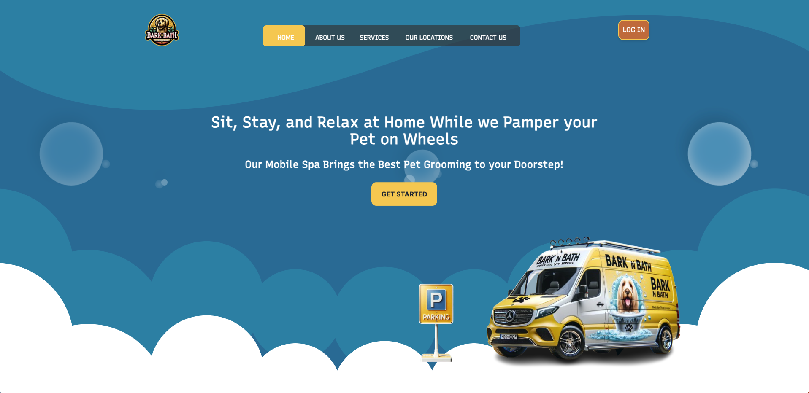

# BarkNBath

Welcome to BarkNBath, the premier mobile spa experience for your beloved pets. Our full-stack application, built with the MERN stack (MongoDB, Express, React, and Node.js), offers a comprehensive suite of services aimed at pampering your pet. From detailed service descriptions to user testimonials, BarkNBath is more than a spa—it's a community for pet lovers.

🚀 **Live Demo**: [Visit BarkNBath](https://barknbath.onrender.com/)

## Features

- **Comprehensive Service Overview**: Learn all about our mobile spa offerings, what we provide, and where our services are available.
- **User Accounts**: Sign up to access personalized features, manage your profile, and keep track of your pet's spa experiences.
- **Pet Profiles**: Create a unique profile for each of your pets to ensure their spa experience is tailored to their needs.
- **Appointment Booking**: Seamlessly book appointments based on real-time availability directly from our intuitive interface.
- **Community Blog**: Share your experiences and tips with our pet-loving community, engage in discussions, and connect with fellow pet owners.
- **Admin Panel**: For administrators, our app provides a comprehensive dashboard to manage appointments, user accounts, and pet profiles.

## Getting Started

To get a local copy up and running, follow these simple steps.

### Prerequisites

Ensure you have npm installed :

npm install npm@latest -g

### Installation

1. Clone the repo
2. Install NPM packages for both backend and frontend : npm install
3. Run the development servers for both backend and frontend : npm run dev

## Usage

After setting up the project, you can:
- Browse our services and read testimonials on the homepage.
- Sign up and log in to access personalized features.
- Create profiles for your pets and book spa appointments.
- Participate in our community blog by sharing stories or tips and commenting on posts.

## Credits

This project exists thanks to all the people who contributed. A special thanks to:

- Nawfal Sentissi
- Xheni gega 

 
